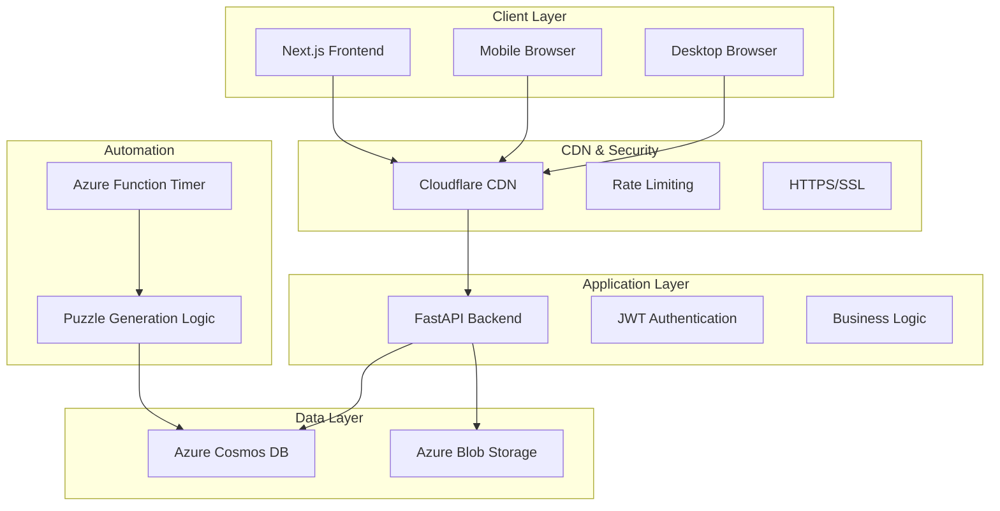

# Design Document

## Overview

ComicGuess is architected as a modern full-stack web application with clear separation between frontend presentation, backend API services, and cloud infrastructure. The system follows a microservices-inspired approach with distinct layers for user interface, business logic, data persistence, and content delivery.

The application uses Next.js 14 for the frontend with server-side rendering capabilities, FastAPI for a high-performance Python backend, Azure cloud services for scalable data storage and content delivery, and Cloudflare for global CDN and security.

## Architecture

### High-Level Architecture



### Technology Stack

**Frontend:**
- Next.js 14 with App Router for modern React development
- Tailwind CSS for utility-first styling and responsive design
- TypeScript for type safety and better developer experience

**Backend:**
- FastAPI for high-performance async Python API
- Pydantic for data validation and serialization
- JWT for stateless authentication

**Database & Storage:**
- Azure Cosmos DB (SQL API) for user data and puzzle metadata
- Azure Blob Storage for character images with CDN integration

**Infrastructure:**
- Cloudflare for CDN, DNS, and security
- Azure Functions for serverless puzzle generation
- Vercel for frontend deployment (or Azure Static Web Apps)
- Azure App Service for backend deployment

## Components and Interfaces

### Frontend Components

#### Core Layout Components
- `UniverseLayout`: Wrapper component handling theme switching (red/blue/black)
- `Navigation`: Tab-based navigation between Marvel, DC, and Image sections
- `ResponsiveContainer`: Mobile-first responsive wrapper

#### Game Components
- `PuzzleInterface`: Main game interface with input field and submission
- `GuessInput`: Character name input with validation and autocomplete
- `SuccessScreen`: Victory display with character image and stats
- `StatsDisplay`: Current streak and guess count visualization

#### Utility Components
- `ThemeProvider`: Context provider for universe-specific theming
- `AuthProvider`: JWT token management and user session
- `ErrorBoundary`: Graceful error handling and fallback UI

### Backend API Endpoints

#### Game Endpoints
```python
POST /guess
# Body: { "userId": str, "universe": str, "guess": str }
# Response: { "correct": bool, "character": str?, "imageUrl": str?, "streak": int }

GET /puzzle/today?universe={marvel|DC|image}
# Response: { "puzzleId": str, "universe": str, "hints": list?, "date": str }
```

#### User Management Endpoints
```python
GET /user/{userId}
# Response: { "id": str, "username": str, "streaks": dict, "stats": dict }

POST /user/{userId}
# Body: { "username": str?, "preferences": dict? }
# Response: { "success": bool, "user": dict }

GET /user/{userId}/stats
# Response: { "totalGames": int, "totalWins": int, "streaks": dict, "history": list }
```

### Data Models

#### User Model
```python
class User(BaseModel):
    id: str
    username: str
    email: str
    created_at: datetime
    streaks: Dict[str, int]  # {"marvel": 5, "DC": 2, "image": 0}
    last_played: Dict[str, str]  # {"marvel": "2024-01-15", "DC": "2024-01-14"}
    total_games: int
    total_wins: int
```

#### Puzzle Model
```python
class Puzzle(BaseModel):
    id: str  # Format: "YYYYMMDD-universe"
    universe: str  # "marvel" | "DC" | "image"
    character: str
    character_aliases: List[str]  # Alternative names/spellings
    image_key: str  # Blob storage path
    created_at: datetime
    active_date: str  # "YYYY-MM-DD"
```

#### Guess Model
```python
class Guess(BaseModel):
    id: str
    user_id: str
    puzzle_id: str
    guess: str
    is_correct: bool
    timestamp: datetime
    attempt_number: int
```

## Error Handling

### Frontend Error Handling
- Network errors: Retry mechanism with exponential backoff
- Invalid guesses: Real-time validation with user feedback
- Authentication errors: Automatic token refresh or redirect to login
- Image loading errors: Fallback placeholder images

### Backend Error Handling
```python
# Custom exception classes
class PuzzleNotFoundError(HTTPException):
    status_code = 404
    detail = "Today's puzzle not found"

class InvalidGuessError(HTTPException):
    status_code = 400
    detail = "Invalid character guess format"

class RateLimitExceededError(HTTPException):
    status_code = 429
    detail = "Too many guess attempts"
```

### Database Error Handling
- Connection failures: Circuit breaker pattern with fallback responses
- Partition key errors: Automatic retry with correct partitioning
- Consistency issues: Eventual consistency handling for stats updates

## Testing Strategy

### Frontend Testing
```typescript
// Component testing with React Testing Library
describe('PuzzleInterface', () => {
  test('submits guess and displays result', async () => {
    render(<PuzzleInterface universe="marvel" />);
    // Test guess submission flow
  });
});

// E2E testing with Playwright
test('complete puzzle solving flow', async ({ page }) => {
  await page.goto('/marvel');
  await page.fill('[data-testid=guess-input]', 'Spider-Man');
  await page.click('[data-testid=submit-guess]');
  // Verify success screen appears
});
```

### Backend Testing
```python
# Unit tests with pytest
def test_validate_guess_correct():
    result = validate_guess("spider-man", "Spider-Man")
    assert result.is_correct == True

# Integration tests
@pytest.mark.asyncio
async def test_guess_endpoint():
    response = await client.post("/guess", json={
        "userId": "test-user",
        "universe": "marvel", 
        "guess": "Spider-Man"
    })
    assert response.status_code == 200
```

### Database Testing
- Unit tests with Cosmos DB Emulator for local development
- Integration tests with test containers for CI/CD
- Performance tests for partition key efficiency

## Security Considerations

### Authentication & Authorization
- JWT tokens with 24-hour expiration and refresh mechanism
- Rate limiting: 10 guesses per minute per user
- CORS configuration for allowed origins only

### Data Protection
- Input sanitization for all user-provided data
- SQL injection prevention through parameterized queries
- Image upload validation and virus scanning

### Infrastructure Security
- HTTPS enforcement through Cloudflare
- Azure Key Vault for sensitive configuration
- Network security groups for backend services
- Regular security updates and dependency scanning

## Performance Optimization

### Frontend Performance
- Next.js static generation for universe pages
- Image optimization with Next.js Image component
- Code splitting by universe for reduced bundle size
- Service worker for offline puzzle caching

### Backend Performance
- FastAPI async/await for concurrent request handling
- Redis caching for frequently accessed puzzle data
- Database connection pooling
- Lazy loading of character images

### CDN & Caching Strategy
- Cloudflare caching for static assets (24 hours)
- Browser caching for character images (7 days)
- API response caching for puzzle metadata (1 hour, invalidated at UTC midnight)
- Edge caching for user statistics (5 minutes)
- Cache invalidation triggers at daily puzzle rotation (UTC 00:00)

## Deployment Architecture

### Frontend Deployment (Vercel)
```yaml
# vercel.json
{
  "builds": [
    { "src": "package.json", "use": "@vercel/next" }
  ],
  "routes": [
    { "src": "/(.*)", "dest": "/" }
  ],
  "env": {
    "NEXT_PUBLIC_API_URL": "@api-url"
  }
}
```

### Backend Deployment (Azure App Service)
```dockerfile
FROM python:3.11-slim
WORKDIR /app
COPY requirements.txt .
RUN pip install -r requirements.txt
COPY . .
EXPOSE 8000
CMD ["uvicorn", "main:app", "--host", "0.0.0.0", "--port", "8000"]
```

### Azure Function (Daily Puzzle Generator)
```python
import azure.functions as func
import logging
from datetime import datetime, timedelta

def main(mytimer: func.TimerRequest) -> None:
    """Triggered daily at UTC midnight to generate new puzzles"""
    if mytimer.past_due:
        logging.info('Timer is past due!')
    
    # Generate puzzles for all three universes
    generate_daily_puzzles()
```

## Monitoring and Analytics

### Application Monitoring
- Azure Application Insights for backend performance
- Vercel Analytics for frontend metrics
- Custom events for puzzle completion rates
- Error tracking with Sentry integration

### Business Metrics
- Daily active users per universe
- Puzzle completion rates and success analysis
- Streak distribution and user retention
- Popular character guess patterns (anonymized and aggregated for privacy compliance)